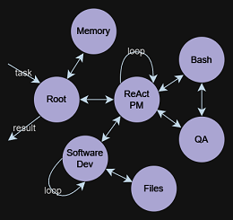

# 🔮 Mentals AI

A tool to build and run cognitive language agents using only natural language, with loops, memory and tools.
This is not just another AI agent framework. With this solution, you can focus only on the logic of the agent itself, without having to worry about writing auxiliary code in Python or any other programming language.
In other words, this is an effort to provide new insights into what the system should look like for future AI applications.

- [Examples](#-examples)
- [Key Concepts](#-key-concepts)
    - [Instruction (prompt)](#-instruction-prompt)
    - [Working Memory (context)](#-working-memory-context)
    - [Short-Term Memory (experimental)](#-short-term-memory-experimental)
    - [Control flow: From strings to algorithms](#-control-flow-from-strings-to-algorithms)
- [Roadmap](#-roadmap)
- [Getting Started](#-getting-started)

## ☯️ The Idea

The idea came from work on psychoanalysis [Exploring Central Executive, Alan Baddeley, 1996](https://www.krigolsonteaching.com/uploads/4/3/8/4/43848243/baddeley_1996.pdf) that there is a system that controls cognitive processes and working memory, that makes retrievals from long-term memory. The LLM can be seen as `System 1`, answering questions, following instructions, but there is no motivation, no goal setting. Okay, what the `System 2` is? We already have an answer from the Middle Ages, which in our time has begun to be considered in a more scientific and applied aspect:

> The `central executive system` is responsible for controlled processing in working memory, including but not limited to, `directing attention`, maintaining task goals, decision making, and memory retrieval.

> The central executive (or executive functions) is responsible for controlled processing in working memory, including but not limited to, directing attention, maintaining task goals, decision making, and memory retrieval. 

**This is the idea behind Mentals — to provide a basic solution on which advanced cognitive agents can be built.**

Two key differences from existing agent frameworks: 
* The agent of any complexity is created in `Markdown` without using any programming language. But you can use Python inside the agent text if you need to;
* This solution does not have built-in reasoning frameworks such as ReAct. This is the basis for building any reasoning framework you invent, including existing ones: `Tree of Thoughts`, `ReAct`, `Self-Discovery`, `Auto-CoT`, etc.

## 📢 Examples

Word chain game in a self-loop controlled by LLM:


> NLOP — Natural Language Operation

Or more complex use cases:
| 🔄 Any multi-agent interactions | 👾 Space Invaders generator agent | 🍄 2D platformer generator agent |
|--------------------|-----------|--------------|
| |  |  |

Or help with the content:
- Collect YouTube videos on a given topic and save to a .csv file with the videos, views, channel name, and link;
- Get the transcription from the video and create a table of contents;
- Take top news from Hacker News, choose a topic and write an article on the topic with the participation of the critic and save to a file.

All of the above examples are located in the `agents` folder.

> [!NOTE]
> Llama3 support for providers with compatible OpenAI chat completion API.

## 📔 Key Concepts

The agent file is a textual description of the agent instructions with a .gen extension.

### 📃 Instruction (prompt)

Instruction is the basic component of an agent in Mentals. An agent can consist of one or more instructions, which can refer to each other. 


Instructions can be written in free form, but they always have a name that starts with the `#` symbol. The `## use:` directive is used to specify a reference to other instructions. Multiple references are listed separated by commas.

Below is an example with two instructions `root` and `meme_explain` with a reference:

```
# root
## use: meme_explain

1. Create 3 memes about AGI;
2. Then do meme explain with meme per call;
3. Output memes and their explanations in a list.

# meme_explain

Explain the gist of the meme in 20 words in medieval style.
Return explanation.
```

In this example, the `root` instruction refers to the `meme_explain` instruction. The response from 
meme_explain is returned to the instruction from which it was called, i.e. to root.

An instruction can take an `input` parameter, which is automatically generated based on the context when the instruction is called. You can specify a *free-form prompt* in the `## input:` directive to specify the input data more precisely, such as a JSON object, or `null`.

Using a document as an input:
```
# some_instruction
## input: design document only
```

JSON object as input:
```
# duckduckgo
## input: { search_query: search query, search_limit: search limit }

Write a Python script to search in DuckDuckGo.
Simulate request headers correctly e.g. user-agent as Mozilla and Linux.
```

> [!NOTE]
> Instruction calls are implemented separately from function/tool calls in OpenAI, allowing you to run agents with Llama3 and similar models. The instruction call implementation is open and is included in the `mentals_system.prompt` file.

#### 🔧 Tool

Tool is a kind of instruction. Mentals has a set of native tools to handle message output, user input, file handling, Python interpreter, Bash commands, and Short-term memory.

Ask user example:
```
# root
## use: user_input

Ask user name.
Then output: `Welcome, user_name!`
```

File handling example:
```
# root
## use: write_file, read_file

Write 'Hello world' to a file.
Then read and output file content.
```

The full list of native tools is listed in the file `native_tools.toml`.


### 📑 Working Memory (context)

Each instruction has its own working memory — context. When exiting an instruction and re-entering it, the context is kept by default. To clear the context when exiting an instruction, you can use the `## keep_context: false` directive:

```
# meme_explain
## keep_context: false

Explain the gist of the meme in 20 words in medieval style.
Return explanation.
```

By default, the size of the instruction context is not limited. To limit the context, there is a directive `## max_context: number` which specifies that only the `number` of the most recent messages should be stored. Older messages will be pushed out of the context. This feature is useful when you want to keep the most recent data in context so that older data does not affect the chain of reasoning.

```
# python_code_generation
## input: development tasks in a list
## use: write_file
## max_context: 5

Do all development tasks in a loop: task by task.
Save the Python code you implement in the main.py file.
```

### 📝 Short-Term Memory (experimental)

Short-term memory is a memory that allows intermediate results of the agent's work to be stored and use it for further reasoning. The contents of this memory are accessible from all instruction contexts.

The `memory` tool is used to store the data. When storing, a keyword and a description of the content are generated. In the example below, the `meme_recall` instruction knows about the meme because it was previously memorized.

```
# root
## use: memory, meme_recall

Come up with and memorize a meme.
Call meme recall.

# meme_recall
## input: nothing

What the meme was about?
```

### 🔀 Control flow: From strings to algorithms

The control flow encompassing conditions, instruction calls, and loops (such as `ReAct`, 
`Auto-CoT`, etc.), is entirely articulated in natural language. This approach allows 
the creation of `semantic conditions` for branching data streams. You can ask an agent 
to play a word chain game by itself, and it will do it in a loop or write a fuzzy exit 
condition: `leave the loop if you are satisfied with the result`, where the LLM and its 
context decides whether to leave or not. And all this without describing flow logic in 
Python or other programming languages.

#### ⛳ Reason Action (ReAct) example

```
## use: execute_bash_command, software_development, quality_assurance

...
You run in a loop of "Thought", "Action", "Observation".
At the end of the loop return with the final answer.
Use "Thought" to describe your thoughts about the task 
you have been asked. Use "Action" to run one of the actions 
available to you. Output action as: "Action: action name to call".
"Observation" will be the result of running those actions.

Your available actions:
- `execute_bash_command` for util purposes e.g. make directory, install packages, etc.;
- `software_development` for software development and bug fixing purposes;
- `quality_assurance` for QA testing purposes.
...
```

#### 🌲 Tree of Thoughts (ToT) example

The idea behind ToT is to generate multiple ideas to solve a problem and then evaluate their value. 
Valuable ideas are kept and developed, other ideas are discarded.

Let's take the example of the 24 game. The 24 puzzle is an arithmetical puzzle in which 
the objective is to find a way to manipulate four integers so that the end result is 24.
First, we define the instruction that creates and manipulates the tree data structure. 
The model knows what a tree is and can represent it in any format, from plain text to XML/JSON or any custom format.

In this example, we will use the plain text format:

```
# tree
## input: e.g. "add to node `A` child nodes `B` and `C`", "remove node `D` with all branches", etc. 
## use: memory
## keep_context: false

Build/update tree structure in formatted text.

Update the tree structure within the specified action;
Memorize final tree structure.
```

Next we need to initialize the tree with initial data, let's start with the root instruction:

```
# root
## use: tree

Input: 4 5 8 2
Generate 8 possible next steps.
Store all steps in the tree as nodes e.g. 
Node value 1: "2 + 8 = 10 (left: 8 10 14)"
Node value 2: "8 / 2 = 4 (left: 4 8 14)"
etc.
```

Calling the root instruction will suggest 8 possible next steps to calculate with the first 2 numbers and store these steps as tree nodes. Further work by the agent results in the construction of a tree that is convenient for the model to understand and infer the final answer.

```
4 5 8 2
├── 4 + 5 = 9 (left: 9, 8, 2)
│   └── discard
├── 4 + 8 = 12 (left: 12, 5, 2)
│   └── discard
├── 4 + 2 = 6 (left: 6, 5, 8)
│   └── discard
├── 5 + 8 = 13 (left: 13, 4, 2)
│   └── discard
├── 5 + 2 = 7 (left: 7, 4, 8)
│   └── (7 - 4) * 8 = 24
├── 8 + 2 = 10 (left: 10, 4, 5)
│   └── discard
├── 4 * 5 = 20 (left: 20, 8, 2)
│   └── (20 - 8) * 2 = 24
└── 4 * 8 = 32 (left: 32, 5, 2)
    └── discard

Based on the evaluations, we have found two successful paths to reach 24:

1. From the node "5 + 2 = 7 (left: 7, 4, 8)", we have the equation: (7 - 4) * 8 = 24.
2. From the node "4 * 5 = 20 (left: 20, 8, 2)", we have the equation: (20 - 8) * 2 = 24.

Thus, the final equations using all given numbers from the input are:
1. (5 + 2 - 4) * 8 = 24
2. (4 * 5 - 8) * 2 = 24
```

A complete example is contained in the `agents/tree_structure.gen`


## 🔜 Roadmap

- [ ] Web UI
- [ ] Vector database tools -- WIP
- [ ] Agent's experience (experimental)
- [ ] Tools: Image generation, Browser

## 🔰 Getting Started

Begin by securing an OpenAI API key through the creation of an  [OpenAI
account](https://platform.openai.com/docs/quickstart?context=node). If you already have 
an API key, skip this step.

### Build and run

Clone the Mentals AI repository:
```shell
git clone https://github.com/turing-machines/mentals-ai
cd mentals-ai
```

The API key must be placed in the `config.toml` file:
```
# OpenAI
API_KEY = "insert API key here"
ENDPOINT = "https://api.openai.com/v1"
MODEL = "gpt-4o"
```

Build project:
```
make
```

Now you can use Mentals:
```shell
./build/mentals agents/loop.gen -d
```
